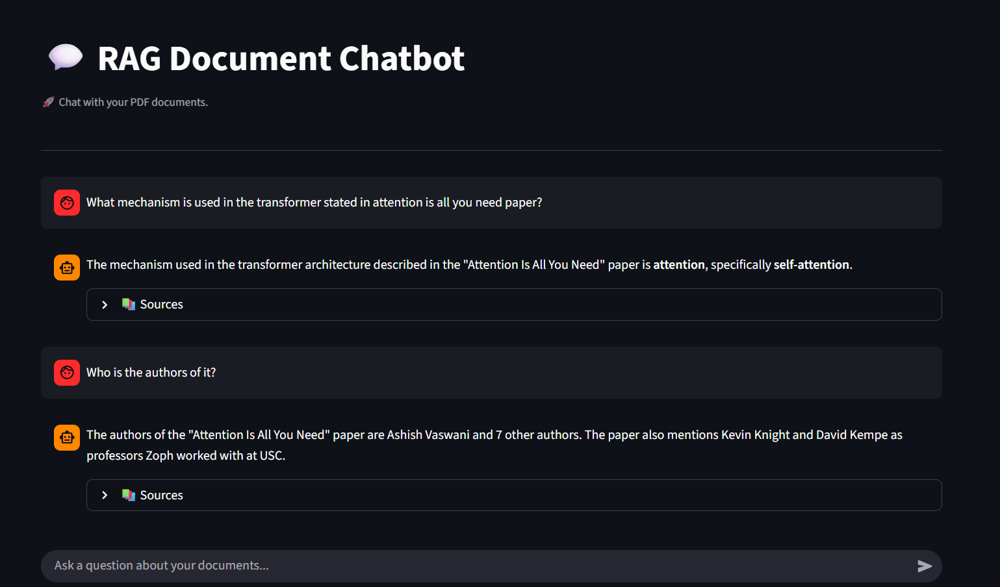
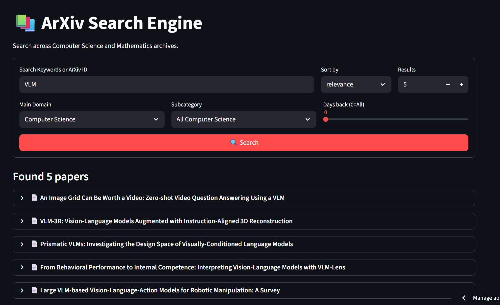
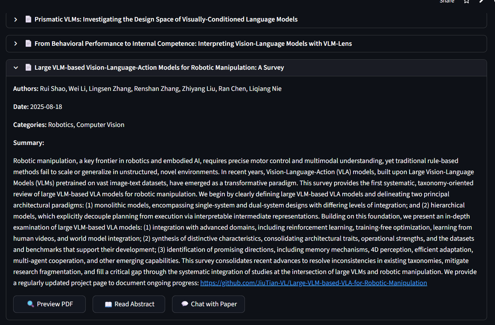
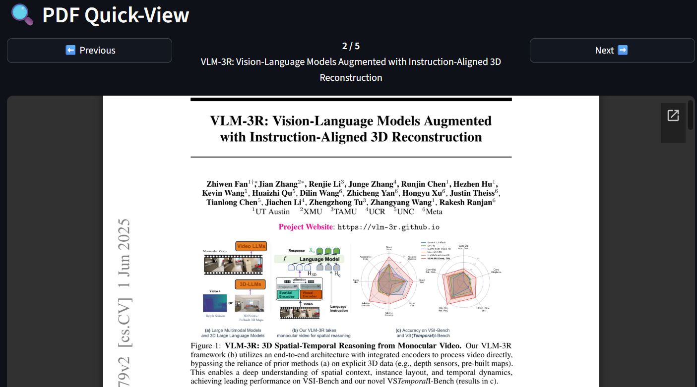

# 🤖 RAG Document Chatbot

This project develop a document assistant chatbot that combines Retrieval-Augmented Generation (RAG) with arXiv research paper search capabilities. Built with LangChain, FastAPI, and Streamlit, this application allows you to chat with your PDF documents and search through academic papers.

## Features

### 💬 Chat Assistant
- **PDF Document Upload**: Upload single or multiple PDF files
- **Intelligent Q&A**: Ask questions about your documents using natural language
- **Contextual Responses**: Powered by Google's Gemini 2.5 Flash Lite model
- **Source Attribution**: View the exact sources (page numbers and content) for each answer
- **Chat History**: Maintains conversation context for follow-up questions
- **Web Search Integration**: Falls back to web search using Tavily when needed

### 📚 ArXiv Search Engine
- **Advanced Search**: Search by keywords or arXiv ID
- **Category Filtering**: Filter by Computer Science or Mathematics domains and subcategories
- **Sort Options**: Sort papers by relevance or recency
- **Time Range**: Filter papers by publication date
- **PDF Preview**: Quick-view PDF directly in the app
- **One-Click Chat**: Queue papers for chatting with Chat Assistant

## Screenshots

### Chat Assistant
 \
*Figure 1: Upload PDFs and chat with your documents using natural language*

### ArXiv Search Engine
 \
*Figure 2: Search and explore academic papers from arXiv*

### Papers Details
 \
*Figure 3: Expand academic papers details*

### Papers Preview
 \
*Figure 4: Preview papers*

## Architecture

```
RAG-langchain-chatbot/
├── backend/             # FastAPI backend
│   ├── main.py          # API endpoints
│   └── rag_pipeline.py  # RAG logic with LangChain
├── frontend/            # Streamlit UI
│   ├── app.py           # Main app with navigation
│   └── pages/
│       ├── chat_assistant.py        # Chat interface
│       └── arxiv_search_engine.py   # ArXiv search interface
├── notebook/            # Jupyter notebooks for development and experiment
├── requirements.txt     # System dependencies
└── .env.example         # Sample of environemnt files
```

## Tech Stack

- **Backend**: FastAPI
- **Frontend**: Streamlit
- **LLM**: Google Gemini 2.5 Flash Lite
- **Embeddings**: Google Generative AI Embeddings (gemini-embedding-001)
- **Vector Store**: FAISS
- **Framework**: LangChain
- **Web Search**: Tavily API
- **Research Papers**: arXiv API

## Prerequisites

- Google Gemini API Key ([Get it here](https://makersuite.google.com/app/apikey))
- Tavily API Key ([Get it here](https://app.tavily.com/home))

## Usage

### Option 1: Access the Deployed Application

Access the application at: **https://rag-document-chatbot-mkam.streamlit.app/**

Upon opening the application, enter your API credentials in the Streamlit sidebar:

1. **Google Gemini API Key** - Required for LLM responses and embeddings
2. **Tavily API Key** - Required for web search functionality

Once you've entered your credentials, you can access both features.
**Note**: If you haven't used the app in a while, it might be "asleep." It can take 2 to 3 minutes to start up and get the database ready for your first question.

### Option 2: Local Setup

If you prefer to run the application locally, switch to the `deployment-test` branch:

```bash
# Clone the repository
git clone https://github.com/yccccc12/RAG-document-chatbot.git
cd RAG-document-chatbot

# Switch to the deployment-test branch
git checkout deployment-test

# Create and activate a virtual environment
python -m venv venv
# On Windows
venv\Scripts\activate
# On macOS/Linux
source venv/bin/activate

# Install dependencies
pip install -r requirements.txt

# Set up environment variables
# Create a .env file in the root directory with:
GOOGLE_API_KEY=your_google_api_key_here
TAVILY_API_KEY=your_tavily_api_key_here

# Start the FastAPI backend (terminal 1)
python backend/main.py

# Start the Streamlit frontend (terminal 2)
streamlit run frontend/app.py
```

The application will be available at `http://localhost:8501`

---

### Using the Chat Assistant

1. Navigate to the **Chat Assistant** page
2. Upload PDF documents via the sidebar
3. Click "Upload" to process the documents
4. Start asking questions in the chat interface
5. View sources by expanding the "Sources" section in responses


### Using the ArXiv Search Engine

1. Navigate to the **ArXiv Search Engine** page
2. Enter search keywords or arXiv ID
3. Select domain and subcategory
4. Configure sort order and time range
5. Click "🔍 Search"
6. Preview PDFs or queue papers for chatting

## 🔧 Configuration

### RAG Pipeline Settings

Edit `backend/rag_pipeline.py` to customize:
- **Chunk size**: Default 800 characters
- **Chunk overlap**: Default 100 characters
- **Model**: Default `gemini-2.5-flash-lite`
- **Temperature**: Default 0.1
- **Max tokens**: Default 1024
- **Retrieval k**: Default 3 documents

### API Endpoints

**FastAPI Backend** (`http://127.0.0.1:8000`):
- `POST /upload_pdf/` - Upload PDF files
- `POST /ask/` - Ask questions (streaming response)
- `POST /ingest-from-url/` - Ingest PDF from URL
- `GET /search/` - Search arXiv papers

## 📊 How It Works

### RAG Pipeline

1. **Document Processing**:
   - PDFs are loaded using PyMuPDF
   - Text is split into chunks using RecursiveCharacterTextSplitter
   - Chunks are embedded using Google's embedding model
   - Embeddings are stored in FAISS vector database

2. **Query Processing**:
   - User question is embedded
   - Similar chunks are retrieved from FAISS
   - Relevance is checked using LLM as judge
     - An AI Judge looks at the retrieved paragraphs to see if they actually contain the answer.
     - Fallback: If the documents don't have the answer, the system automatically uses Tavily to search the web for real-time information.
   - Context is provided to Gemini for answer generation


## License

This project is open source and available under the [MIT License](LICENSE).

## Acknowledgments

- [Google Gemini](https://ai.google.dev/) for providing the LLM.
- [LangChain](https://www.langchain.com/) for the RAG framework
- [arXiv](https://arxiv.org/) for research paper access